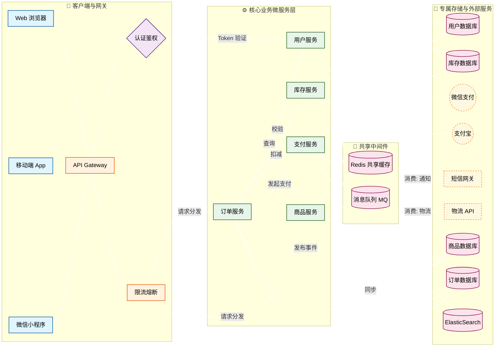

## 标题

使用“#”控制标题大小，最大为1个“#”，最小为6个“#”，此标题为"##"

```html
写法：
#(一个空格)(文字)
##(一个空格)(文字)
...
```

## 引用

### 不带出处的引用

> Cyka Blyat.
```html
写法： 
> Cyka Blyat.
```

### 带有出处的引用

> 不要通过共享内存来通信，而要通过通信来共享内存。<br>
> — <cite>Rob Pike[^1]</cite>&nbsp;（点击1跳转页脚）
[^1]: 以上引用摘自 Rob Pike 在Gopherfest期间的[演讲](https://www.youtube.com/watch?v=PAAkCSZUG1c)。

```html
出处在页脚可以看到 ,用[ ]括起来的文字可以转化为超链接并隐藏跳转链接
写法：  
> 不要通过共享内存来通信，而要通过通信来共享内存。<br>
> — <cite>Rob Pike[^1]</cite>&nbsp;（点击1跳转页脚）
[^1]: 以上引用摘自 Rob Pike 在Gopherfest期间的[演讲](https://www.youtube.com/watch?v=PAAkCSZUG1c)。 


```


### 带提示的引用

> [!NOTE]
> 突出显示用户在快速浏览时也应注意的信息。

> [!TIP]
> 可选信息，帮助用户更顺利地完成任务。

> [!IMPORTANT]
> 用户成功所必需的关键信息。

> [!WARNING]
> 由于潜在风险而需要用户立即关注的关键内容。

> [!CAUTION]
> 某个操作可能带来的负面后果。

> [!NOTE] 自定义标题
> 如果你想使用自定义标题，可以在方括号后面添加标题文本，如上所示。

```html
写法：
> [!NOTE]
> 突出显示用户在快速浏览时也应注意的信息。
> [!TIP]
> 可选信息，帮助用户更顺利地完成任务。
> [!IMPORTANT]
> 用户成功所必需的关键信息。
> [!WARNING]
> 由于潜在风险而需要用户立即关注的关键内容。
> [!CAUTION]
> 某个操作可能带来的负面后果。
> [!NOTE] 自定义标题
> 如果你想使用自定义标题，可以在方括号后面添加标题文本，如上所示。
```

## 表格

   | 姓名  | 年龄 |
   | ----- | ---- |
   | Nikita   | 27   |
   | Suka | 23   |
```html
写法：
   | 姓名  | 年龄 |
   | ----- | ---- |
   | Nikita   | 27   |
   | Suka | 23   |
```


### 表格内的 Markdown

| *斜体* | **加粗** | `代码` |
```html
写法:
| *斜体* | **加粗** | `代码` | 
普通文本如果误用代码标记，可以在代码标记前加\
示例： \*斜体\*
``` 
<br> 

| A    | B             | C         | D          | E                   |
| --------- | ------------- | ---------------- | -------------- | ---------------- |
| 对应A下方的内容. | 对应B下方的内容.. | 对应C下方的内容. | 对应D下方的内容. | 对应E下方的内容.|

```html
表格与其他元素间无法换行用：
<br>放置在单行用于换行，
且表格会自适应，
写法：
| A    | B             | C         | D          | E                   |
| --------- | ------------- | ---------------- | -------------- | ---------------- |
| 对应A下方的内容. | 对应B下方的内容.. | 对应C下方的内容. | 对应D下方的内容. | 对应E下方的内容.|

```

## 代码块
```html
Cyka Blyat
Cyka Blyat
```
如果要代码块内嵌代码块，加 \` 的数量，注意 \` 的配对
````html
写法： 
```html
Cyka Blyat
Cyka Blyat
```
````

## 列表类型

### 有序列表
1. 第一项
2. 第二项
3. 第三项
```html
1. 第一项
2. 第二项
3. 第三项
```
### 无序列表

* 列表项
* 另一项
* 还有一项
```html
* 列表项
* 另一项
* 还有一项
```
### 嵌套列表

* 水果
  * 苹果
  * 橘子
  * 香蕉
* 乳制品
  * 牛奶
  * 奶酪
```html
* 水果
  * 苹果
  * 橘子
  * 香蕉
* 乳制品
  * 牛奶
  * 奶酪
```
## 其他元素

H<sub>2</sub>O

X<sup>n</sup> + Y<sup>n</sup> = Z<sup>n</sup>

按 <kbd>CTRL</kbd> + <kbd>ALT</kbd> + <kbd>Delete</kbd> 结束会话。

大多数<mark>蝾螈</mark>是夜行性的，捕食昆虫、蠕虫和其他小型生物。
```html
H<sub>2</sub>O

X<sup>n</sup> + Y<sup>n</sup> = Z<sup>n</sup>

按 <kbd>CTRL</kbd> + <kbd>ALT</kbd> + <kbd>Delete</kbd> 结束会话。

大多数<mark>蝾螈</mark>是夜行性的，捕食昆虫、蠕虫和其他小型生物。
```
## marmaid图表
直接用\`\`\`mermaid和\`\`\`包裹标准marmaid内容即可
