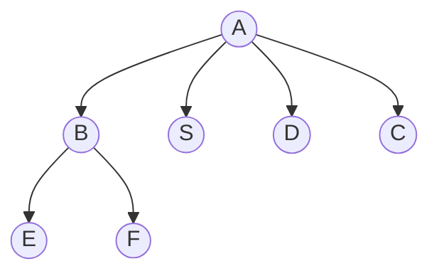
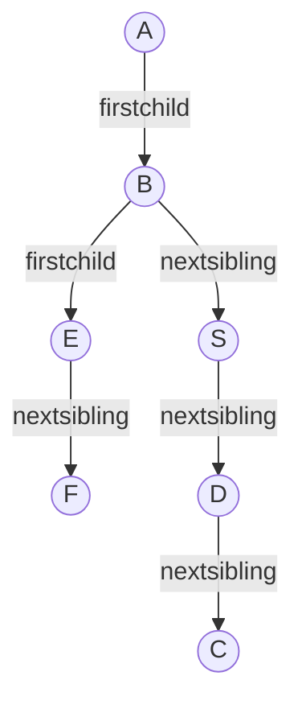
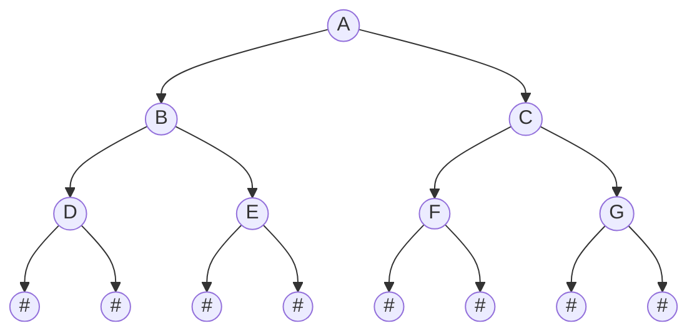
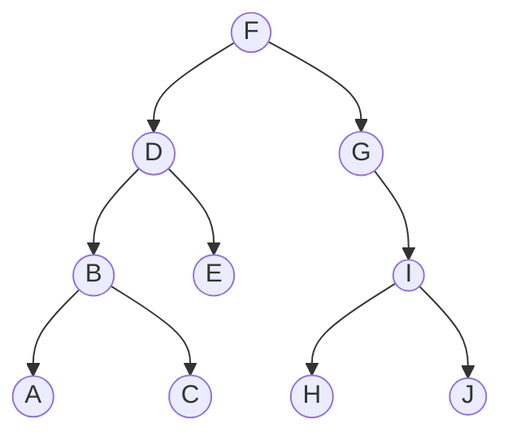
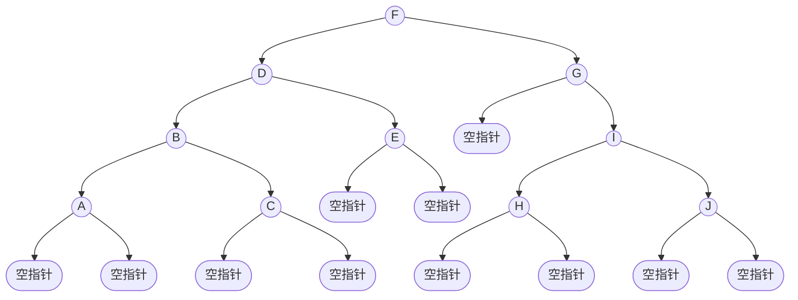
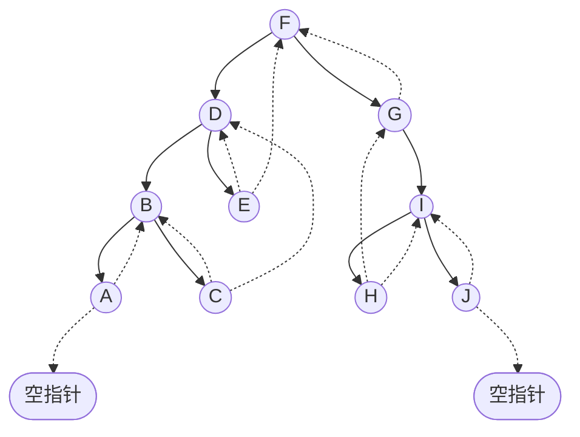
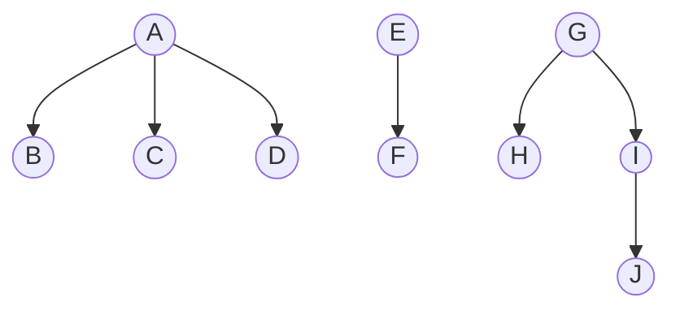
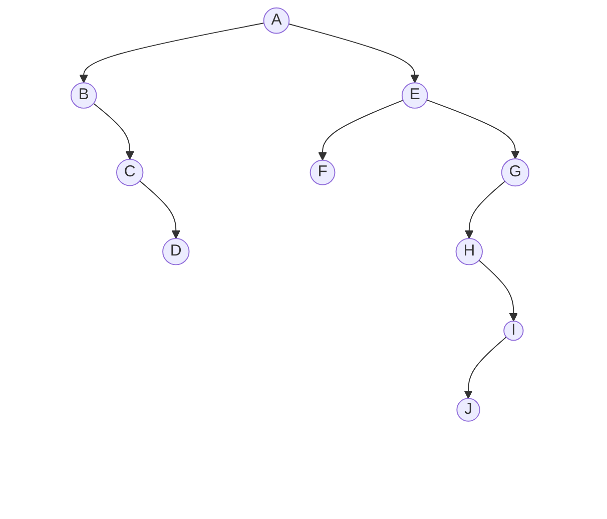
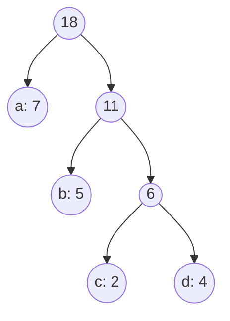
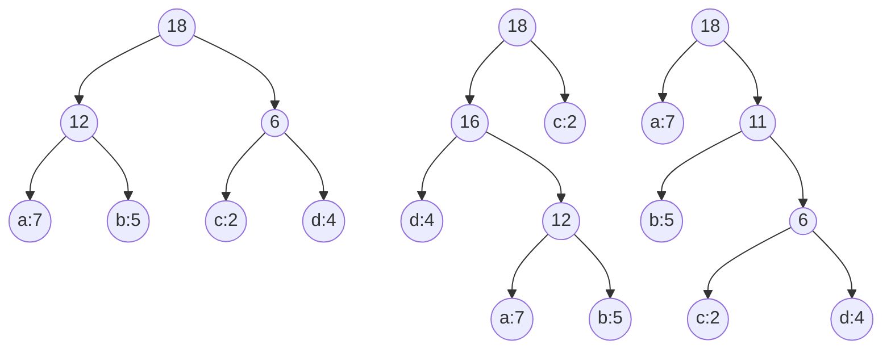

## 树
树结构是一类重要的非线性数据结构，是n个结点的有限集  
基本术语：
* 结点：树中的一个独立单元  
* 结点的度：结点拥有的子树数称为结点的度
* 树的度：树内各结点度的最大值
* 叶子：度为0的结点被称为叶子或终端结点
* 非终端结点：度不为0的结点被称为非终端结点或分支结点
* 双亲和孩子：结点的子树的根被称为该结点的孩子，该结点称为孩子的双亲
* 兄弟：同一个双亲的孩子之间互称兄弟
* 祖先：从根到该结点所经分支上的所有结点
* 子孙：以某结点为根的子树中的任一结点被称为该结点的子孙
* 层次：结点的层次从根开始定义，根为第一层，根的孩子为第二层，树中任一结点的层次等于其双亲结点的层次加1
* 堂兄弟：双亲在同一层的结点互为堂兄弟
* 树的深度：树中结点的最大层次称为树的深度或高度
* 有序树和无序树：如果将树中结点的各子树看成从左至右是有次序的（不能互换），则称该树为有序树，否则称为无序树，在有序树中最左边的子树的根称为第一个孩子，最右边的称为最后一个孩子。
* 森林：m（m>=0）棵互不相交的树的集合
### 结构体
```c
typedef char TElemType;
typedef struct CSNode
{
	TElemType data;
	struct CSNode* firstchild;
	struct CSNode* nextsibling;
}CSNode, *CSTree;
```
### 初始化
```c
void InitCSTree(CSTree* T)
{
	*T = NULL;
}
```
### 创建根结点
```c
void CreateCSTreeRoot(CSTree* T, TElemType data)
{
	*T = (CSTree)malloc(sizeof(CSNode));
	(*T)->data = data;
	(*T)->firstchild = NULL;  //  指向本结点第一个孩子
	(*T)->nextsibling = NULL;  //  指向本结点右侧第一个兄弟
}
```
### 指定结点添加孩子
```c
void AddFirstChild(CSTree parent, TElemType data)
{
	if(!parent)
		return;
	CSNode* child = (CSNode*)malloc(sizeof(CSNode));
	child->data = data;
	child->firstchild = NULL;
	child->nextsibling = parent->firstchild;  // 将新孩子的兄弟指向原来的第一个孩子
	parent->firstchild = child;  // 将父结点的第一个孩子指向新孩子
}
```
### 指定结点添加右兄弟
```c
void AddRightSibling(CSTree node, TElemType data)
{
	if(!node)
		return;
	CSNode* child = (CSNode*)malloc(sizeof(CSNode));
	child->data = data;
	child->firstchild = NULL;
	child->nextsibling = node->nextsibling;  // 将新兄弟的兄弟指向原来的右兄弟
	node->nextsibling = child;  // 将原兄弟的右兄弟指向新兄弟
}
```
### 先序遍历
```c
void PreOrderTraverse(CSTree T)
{
	if (T)
	{
		printf("%c ", T->data);  // 访问根结点
		PreOrderTraverse(T->firstchild);  // 递归访问第一个孩子
		PreOrderTraverse(T->nextsibling);  // 递归访问右兄弟
	}
}
```
### 后序遍历
```c
void PostOrderTraverse(CSTree T)
{
	if (T)
	{
		PostOrderTraverse(T->firstchild);  // 递归访问第一个孩子
		printf("%c ", T->data);  // 访问根结点
		PostOrderTraverse(T->nextsibling);  // 递归访问右兄弟
	}
}
```
### 销毁树
```c
void DestroyCSTree(CSTree* T)
{
	if (*T)
	{
		DestroyCSTree(&(*T)->firstchild);  // 递归销毁第一个孩子
		DestroyCSTree(&(*T)->nextsibling);  // 递归销毁右兄弟
		free(*T);  // 释放当前结点
		*T = NULL;  // 将指针置空
	}
}
```
### 测试环节
```c
int main()
{
	CSTree T;
	printf("初始化树\n");
	InitCSTree(&T);
	printf("初始化完成！\n");
	printf("创建根结点A\n");
	CreateCSTreeRoot(&T, 'A');
	printf("创建完成！\n");
	printf("给A结点添加孩子C、D、B：\n");
	AddFirstChild(T, 'C');
	AddFirstChild(T, 'D');
	AddFirstChild(T, 'B');
	printf("添加完成！\n");
	printf("给B结点添加孩子E、F：\n");
	AddFirstChild(T->firstchild, 'F');
	AddFirstChild(T->firstchild, 'E');
	printf("添加完成！\n");
	printf("先序遍历：\n");
	PreOrderTraverse(T);
	printf("\n");
	printf("\n");
	printf("给B添加右兄弟S：\n");
	AddRightSibling(T->firstchild, 'S');
	printf("添加完成！\n");
	printf("先序遍历：\n");
	PreOrderTraverse(T);
	printf("\n");
	printf("后序遍历：\n");
	PostOrderTraverse(T);
	printf("\n");
	printf("销毁树\n");
	DestroyCSTree(&T);
	printf("销毁完成！\n");
	return 0;
}
```
测试结果如下:
```html
初始化树
初始化完成！
创建根结点A
创建完成！
给A结点添加孩子C、D、B：
添加完成！
给B结点添加孩子E、F：
添加完成！
先序遍历：
A B E F D C

给B添加右兄弟S：
添加完成！
先序遍历：
A B E F S D C
后序遍历：
E F B S D C A
销毁树
销毁完成！
```
### 图示



## 二叉树
二叉树是n个结点所构成的集合，是每个结点最多有2个子树的有序树，空树也是合法的二叉树  
二叉树与树的区别主要有两点：  
（1）二叉树每个结点最多只有两棵子树（不存在度大于2的结点，只能是0，1，2）  
（2）二叉树的子树有左右之分，其次序不能任意颠倒
核心性质：
* 二叉树的左右子树是有序的，即使只有一个孩子，也要明确是左是右
* 第i层最多有2<sup>i-1</sup>个结点（i>=1）
* 深度为k的二叉树最多有2<sup>k</sup>-1个结点（满二叉树）
* 叶子结点数=度为2的结点数+1（n<sub>0</sub>=n<sub>2</sub>+1）
* 满二叉树：所有层的结点数都达到最大值，所有叶子结点都在最后一层，没有度为1的结点
* 完全二叉树：除了最后一层，其他层都是慢的，最后一层的结点从左到右连续排列，不能有空缺  
### 存储结构
#### 顺序存储（数组）
适用：完全二叉树/满二叉树（空间利用率高）  
原理：按层序编号，将结点存入数组对应下标（根存下标1）
缺点：普通二叉树会浪费大量空间
```c
#define MAXSIZE 100
typedef int ElemType;
ElemType SqBiTree[MAXSIZE];
```
#### 链式存储（二叉链表）
适用：所有二叉树（空间利用率高）
原理：每个结点包含数据域+左孩子指针+右孩子指针
```c
typedef char ElemType;
typedef struct BiTNode
{
	ElemType data;
	struct BiTNode* lchild;
	struct BiTNode* rchild;
}BiTNode, * BiTree;
```
### 代码应用
#### 初始化
```c
void InitBiTree(BiTree* T)
{
	*T = NULL;
}
```
#### 先序创建二叉树
```c
void CreateBiTree(BiTree* T)
{
	char ch;
	scanf(" %c", &ch);
	if (ch == '#')
		*T = NULL;
	else
	{
		*T = (BiTNode*)malloc(sizeof(BiTNode));
		(*T)->data = ch;
		CreateBiTree(&(*T)->lchild);
		CreateBiTree(&(*T)->rchild);
	}
}
```
#### 先序遍历二叉树
```c
void PreOrderTraverse(BiTree T)
{
	if (T)
	{
		printf("%c ", T->data);  // 中序遍历此句向下移一行，后序遍历此句向下移两行
		PreOrderTraverse(T->lchild);
		PreOrderTraverse(T->rchild);
	}
}
```
#### 求二叉树的深度
```c
int BiTreeDepth(BiTree T)
{
	if (T == NULL)
		return 0;
	else
	{
		int ldepth = BiTreeDepth(T->lchild);
		int rdepth = BiTreeDepth(T->rchild);
		return (ldepth > rdepth ? ldepth : rdepth) + 1;
	}
}
```
#### 求结点总数
```c
int CountNodesCount(BiTree T)
{
	if (T == NULL)
		return 0;
	else
		return CountNodesCount(T->lchild) + CountNodesCount(T->rchild) + 1;
}
```
#### 求叶子结点数
```c
int CountLeafNodesCount(BiTree T)
{
	if (T == NULL)
		return 0;
	else if (T->lchild == NULL && T->rchild == NULL)
		return 1;
	else
		return CountLeafNodesCount(T->lchild) + CountLeafNodesCount(T->rchild);
}
```
#### 销毁二叉树
```c
void DestroyBiTree(BiTree* T)
{
	if (*T)
	{
		DestroyBiTree(&(*T)->lchild);
		DestroyBiTree(&(*T)->rchild);
		free(*T);
		*T = NULL;
	}
}
```
#### 测试环节
```c
int main()
{
	BiTree T;
	InitBiTree(&T);

	printf("请按先序序列输入二叉树的结点（输入 '#' 表示空结点，直接连续输入无需空格）：\n");
	printf("例如输入: ABD##E##CF##G##\n> ");
	CreateBiTree(&T);
	printf("先序遍历结果: ");
	PreOrderTraverse(T);
	printf("\n");

	printf("二叉树的深度: %d\n", BiTreeDepth(T));
	printf("二叉树的结点总数: %d\n", CountNodesCount(T));
	printf("二叉树的叶子结点总数: %d\n", CountLeafNodesCount(T));

	printf("销毁二叉树\n");
	DestroyBiTree(&T);
	if (T == NULL) {
		printf("二叉树已成功销毁。\n");
	}

	return 0;
}
```
若按提示输入，输出结果如下：
```html
请按先序序列输入二叉树的结点（输入 '#' 表示空结点，直接连续输入无需空格）：
例如输入: ABD##E##CF##G##
> ABD##E##CF##G##
先序遍历结果: A B D E C F G
二叉树的深度: 3
二叉树的结点总数: 7
二叉树的叶子结点总数: 4
销毁二叉树
二叉树已成功销毁。
```  
#### 原理图示（按提示输入）

## 线索二叉树
线索二叉树建立在普通二叉树的基础上，先说好处：  
（1）回收闲置指针，节省内存  
（2）不用递归、不用栈，就能遍历整棵树  
（3）快速查找任意节点的前驱、后继  
来看同一张图的三种遍历：

先序遍历：F D B A C E G I H J  
中序遍历：A B C D E F G H I J  
后序遍历：A C B E D H J I G F  
查找每个结点的孩子很容易，只需要通过左右指针找到，  
但想要找到结点在遍历中的前驱或者后继，只能从头遍历，在遍历的过程中记录它的前驱或者后继  。  
在二叉链表里，空指针的个数等于结点数+1，如图：

我们完全可以通过利用这些空指针，结点的左空指针指向前驱，右空指针指向后驱。  
这种指向前驱或者后驱的指针，我们称为线索，我们在图中一般用虚线表示它们。  
绝大多数线索二叉树都是中序线索二叉树，如图：

### 结构体
```c
typedef char ElemType;
typedef struct BiThrNode
{
    ElemType data;
    struct BiThrNode* lchild;
    struct BiThrNode* rchild;
    int ltag, rtag;   //  (在二叉树的基础上，加上 ltag 和 rtag)
} BiThrTNode, * BiThrTree;
```  
### 单个结点的结构
| lchild | ltag | data | rtag | rchild |
| :----: | :--: | :--: | :--: | :----: |
| 指针，指向左孩子或前驱线索 | 标志位（0或1） | 数据域 | 右标志位（0或1） | 指针，指向右孩子或后驱线索 |    

ltag：为0则lchild指向左孩子，为1则lchild指向前驱  
rtag：为0则rchild指向右孩子，为1则rchild指向后驱  
注：无前驱也无左孩子，无后驱也无后孩子的结点，ltag或rtag为1
### 构造线索二叉树
先构造一棵普通的二叉树，然后对其进行中序线索化  
线索化通常是在中序遍历的过程中完成的。我们需要一个指针 pre，它始终指向刚刚访问过的上一个结点  
全局变量：BiThrTNode* pre = NULL;  
但我们要先创建一个二叉树
```c
BiThrTree CreateBiThrTree()
{
    char ch;
    scanf("%c", &ch);
    if (ch == '#')
    {
        return NULL;
    }
    else
    {
        BiThrTree T = (BiThrTree)malloc(sizeof(BiThrTNode));
        T->data = ch;
        T->ltag = 0;
        T->rtag = 0;
        T->lchild = CreateBiThrTree();
        T->rchild = CreateBiThrTree();
        return T;
    }
}
```
然后开始中序线索化：
```c
void InThreading(BiThrTree p)
{
    if (p != NULL)
    {
        InThreading(p->lchild);
        if (p->lchild == NULL)
        {
            p->ltag = 1;
            p->lchild = pre;
        }
        if (pre != NULL && pre->rchild == NULL)
        {
            pre->rtag = 1;
            pre->rchild = p;
        }
        pre = p;
        InThreading(p->rchild);
    }
}
```
### 遍历线索二叉树
遍历线索化二叉树不需要递归，不需要借助栈，直接顺着线索（指针）像遍历链表一样顺延即可。  
定义FirstNode函数寻找中序遍历的起点（最左下角的结点）
```c
BiThrTree FirstNode(BiThrTree p)
{
    while (p != NULL && p->ltag == 0)
    {
        p = p->lchild;
    }
    return p;
}
```
定义NextNode函数寻找当前结点的后继
```c
BiThrTree NextNode(BiThrTree p)
{
    if (p->rtag == 0)
    {
        return FirstNode(p->rchild); 
    }
    else
    {
        return p->rchild;            
    }
}
//  情况 A：p->rtag == 0，调用FirstNode，返回遍历起点
//  情况 B：p->rtag == 1，之前线索化时，右指针指向中序后继，直接顺着返回下一个结点
```
最后定义InOrderTraverse_Thr来进行主遍历
```c
void InOrderTraverse_Thr(BiThrTree T)
{
    BiThrTree p;
    if (T == NULL) return;
    
    p = FirstNode(T);   //  找出遍历起点
    
    while (p != NULL)   
    {
        printf("%c ", p->data);  //  打印当前节点数据
        p = NextNode(p);  //  跳至下一个节点
    }
    printf("\n");
}
```
### 测试环节
在执行完 InThreading(T) 之后，全局变量 pre 会停留在中序遍历的最后一个节点上。  
此时该节点的 rchild 虽然是 NULL，但是它的 rtag 依然是初始化的 0。  
按照线索二叉树的严格定义，如果没有右孩子，rtag 应该为 1。
所以我们要在主程序里加一个收尾：  
if (pre != NULL)  
    {  
&emsp;&emsp;pre->rtag = 1;  
    }  
```c
int main()
{
    BiThrTree T;
    printf("请按先序序列输入二叉树的结点（输入 '#' 表示空结点，直接连续输入无需空格）：\n");
    T = CreateBiThrTree();
    InThreading(T);
    if (pre != NULL)
    {
        pre->rtag = 1;
    }
	printf("中序遍历结果为：");
    InOrderTraverse_Thr(T);
    return 0;
}
```
输出结果如下（输入ABD##E##CF##G##）
```html
请按先序序列输入二叉树的结点（输入 '#' 表示空结点，直接连续输入无需空格）：
ABD##E##CF##G##
中序遍历结果为：D B E A F C G
```
## 树和森林
### 孩子兄弟表示法
这一小章主要目的为将任意普通树伪装成二叉树，这样就能复用二叉树的代码，也能统一存储结构，统一遍历算法
这个方法叫做：左孩子右兄弟表示法  
虽然逻辑上它是一棵多叉树或森林，但在计算机内存里，它依然是一棵只有两个指针的二叉树。
```html
    【普通树】                  【左孩子右兄弟表示法】

        A                           A
      / | \                        /
     B  C  D                      B ---- C ---- D
    / \                          /                       
   E   F                        E ---- F
```
对于普通树里任何一个结点，我们依然给它分配两个指针（lchild 和 rchild），但赋予它们新的含义  
lchild (左指针)：永远指向它的“第一个孩子”  
rchild (右指针)：永远指向它的“下一个兄弟”  
#### 结构体
```c
typedef char ElemType;
typedef struct CSNode {
    ElemType data;
    struct CSNode* firstchild;
    struct CSNode* nextsibling;
} CSNode, * CSTree;
```
#### 创建二叉树  
（可大致复用二叉树的创建代码）
```c
void CreateCSTree(CSTree *T)
{
    char ch;
    scanf(" %c", &ch);
    if (ch == '#')
    {
        *T = NULL;
    }
    else
    {
        *T = (CSTree)malloc(sizeof(CSNode));
        (*T)->data = ch;
        CreateCSTree(&((*T)->firstchild));
        CreateCSTree(&((*T)->nextsibling));
    }
}
```
#### 先序遍历
```c
void PreOrder(CSTree T)
{
    if (T != NULL)
    {
        printf("%c ", T->data);
        PreOrder(T->firstchild);
        PreOrder(T->nextsibling);
    }
}
```
#### 测试环节
```c
int main()
{
    CSTree T = NULL; 
    printf("请按先序序列输入二叉树的结点（输入 '#' 表示空结点，直接连续输入无需空格）：\n");
    CreateCSTree(&T); 
    PreOrder(T);
    printf("\n");
    return 0;
}
```
测试结果如下（若按上图输入ABE#F##C#D###）：
```html
请按先序序列输入二叉树的结点（输入 '#' 表示空结点，直接连续输入无需空格）：
ABE#F##C#D###
A B E F C D
```
### 森林转二叉树  
在代码层面，森林转二叉树不需要写任何新代码  
方法：左孩子右兄弟，把第二棵树的根，当成第一棵树的兄弟，演示如下：  
转化前的森林：

转化后的二叉树：  

相关代码可完全复用二叉树相关代码  
## 哈夫曼树
我们先来了解相关概念定义：
* 路径：在一棵树中，一个结点到另一个结点之间的通路，称为路径
* 路径长度：路径上的分支数目，一条路径中，每经过一个结点，路径长度都要加 1
* 结点的权：给结点赋予一个新的数值，被称为这个结点的权
* 结点的带权路径长度：根结点到该结点之间的路径长度与该结点的权的乘积,下图结点 b 的带权路径长度为2x5=10
* 树的带权路径长度：树中所有叶子结点的带权路径长度之和,记作WPL,下图WPL=7x1+5x2+2x3+4x3=35

哈夫曼树：当用 n 个结点（都做叶子结点且都有各自的权值）试图构建一棵树时，如果构建的这棵树的带权路径长度最小，称这棵树为“最优二叉树”，也就是哈夫曼树  
构建规则：每次挑两个最小的合并，权重越大的结点离树根越近

                      左树：WPL=36                   中树：WPL=46            右树：WPL=35  
右图严格按照“每次挑两个最小的合并”的规则生成，从而实现了 WPL = 35 的全局最优解
### 哈夫曼树结点结构体
我们通常使用数组来存储哈夫曼树的所有结点
```c
typedef struct 
{
    int weight;  //  结点权重
    int parent,lchild,rchild;  //  父结点、左孩子、右孩子在数组中的位置下标
}HTNode,* HuffmanTree;
```
### 构造哈夫曼树
假设我们有n个叶子结点，那么整棵哈夫曼树一共有2n−1个结点，我们需要一个长度为2n−1的数组。  
逻辑：  
（1）找最小：在当前数组中，找到两个没有父结点（即 parent==0）且权值最小的结点，假设它们的下标是 s1 和 s2。  
（2）合并：创建一个新结点（放在数组的下一个空位），s1 和 s2 的权值之和为新结点的权值。  
（3）认亲：把新结点的左孩子设为 s1，右孩子设为 s2，同时，把 s1 和 s2 的父结点设为这个新结点。  
辅助函数（寻找最小和次小）
```c
#include <limits.h>
void select(HuffmanTree HT, int n, int *s1, int *s2)
{
    int min1 = INT_MAX;
    int min2 = INT_MAX;
    *s1 = 0;
    *s2 = 0;
    for (int i = 1; i <= n; ++i)
    {
        if (HT[i].parent == 0)
        {
            if (HT[i].weight < min1)
            {
                min2 = min1;
                *s2 = *s1;
                min1 = HT[i].weight;
                *s1 = i;
            }
            else if (HT[i].weight < min2)
            {
                min2 = HT[i].weight;
                *s2 = i;
            }
        }
    }
}
```
构造函数
```c
void CreateHuffmanTree(HuffmanTree *HT, int n)
{
    if (n <= 1) return;
    int m = 2 * n - 1;
    *HT = (HuffmanTree)malloc((m + 1) * sizeof(HTNode));
    for (int i = 1; i <= m; ++i)
    {
        (*HT)[i].parent = 0;
        (*HT)[i].lchild = 0;
        (*HT)[i].rchild = 0;
    }
    for (int i = 1; i <= n; ++i)
    {
        scanf("%d", &(*HT)[i].weight);
    }
    int s1, s2;
    for (int i = n + 1; i <= m; ++i)
    {
	select(*HT, i - 1, &s1, &s2);
        (*HT)[s1].parent = i;
        (*HT)[s2].parent = i;
        (*HT)[i].lchild = s1;
        (*HT)[i].rchild = s2;
        (*HT)[i].weight = (*HT)[s1].weight + (*HT)[s2].weight;
    }
}
```
### 哈夫曼编码
哈夫曼编码是计算机世界中最经典的数据压缩算法  
核心思想：高频词用短码，低频词用长码，这样整篇文章压缩下来的总长度（WPL）是最短的！  
哈夫曼编码有一个神奇的特性叫“前缀编码”，保证了解码时绝对不会出错  
如何编码？  
在我们用数组存的哈夫曼树中，每个节点只知道自己的父亲（parent）是谁，却不知道自己是父亲的左孩子还是右孩子  
所以，我们求编码的路线必须反过来：从叶子节点出发，顺着 parent 往上爬，一直爬到树根  
我们用字符串数组来存字符的编码  
```c
typedef char** HuffmanCode;
void CreateHuffmanCode(HuffmanTree HT, HuffmanCode* HC, int n)
{
    *HC = (HuffmanCode)malloc((n + 1) * sizeof(char*));  //  地址簿
    char* cd = (char*)malloc(n * sizeof(char));  //  草稿纸
    cd[n - 1] = '\0'; 

    for (int i = 1; i <= n; ++i)
    {
        int start = n - 1;
        int c = i;
        int f = HT[i].parent;
        while (f != 0)
        {
            --start;
            if (HT[f].lchild == c)
                cd[start] = '0';
            else
                cd[start] = '1';

            c = f;
            f = HT[f].parent;
        }
        (*HC)[i] = (char*)malloc((n - start) * sizeof(char));
        strcpy((*HC)[i], &cd[start]);
    }
    free(cd);
}
```
测试环节：  
```c
int main()
{
    HuffmanTree HT = NULL;
    HuffmanCode HC = NULL;
    int n;
    printf("请输入叶子结点的个数(n > 1): ");
    if (scanf("%d", &n) != 1 || n <= 1)
    {
        printf("请输入有效的节点个数！\n");
        return 1;
    }
    printf("请输入 %d 个节点的权值 (用空格分隔):\n", n);
    CreateHuffmanTree(&HT, n);
    CreateHuffmanCode(HT, &HC, n);
    printf("节点序号\t权值\t哈夫曼编码\n");
    for (int i = 1; i <= n; ++i)
    {
        printf("  %d\t\t%d\t%s\n", i, HT[i].weight, HC[i]);
    }
    for (int i = 1; i <= n; ++i)
    {
        free(HC[i]);
    }
    free(HC);
    free(HT);
    return 0;
}
```
测试结果如下：  
```html
请输入叶子结点的个数(n > 1): 5
请输入 5 个节点的权值 (用空格分隔):
10 14 12 20 15
节点序号        权值    哈夫曼编码
  1             10      110
  2             14      00
  3             12      111
  4             20      10
  5             15      01
```